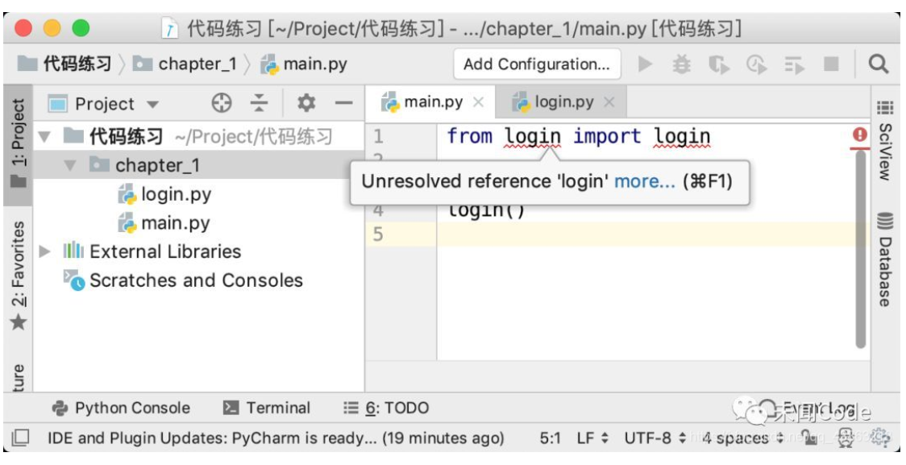
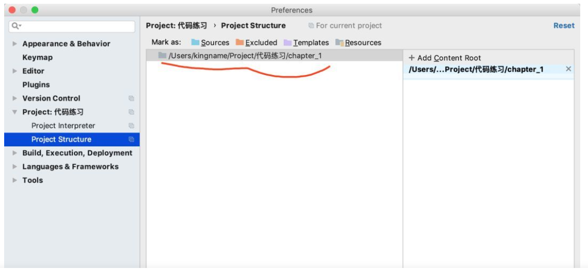

# 为什么Python代码能运行但是PyCharm给我画红线？

首先我们创建一个login.py文件，它的内容如下：

```python
def login():    print('登录服务器')
```

再创建一个 main.py，它的内容如下：

```python
from login import login
print('准备登录服务器')login()
```


这两个文件的文件结构如下图所示：


此时，你在PyCharm中打开main.py，你就会发现红色的波浪线，如下图所示。



此时如果使用PyCharm来运行这个main.py文件,你会发现PyCharm运行程序毫无问题：


### **原因:**

####运行没问题:

Python有一个工作区的概念，在默认情况下，当你使用 python xxx.py运行一个.py文件时，工作区就是你运行的这个.py文件所在的文件夹。由于login.py和main.py文件是放在同一个文件夹里面的，所以当你直接运行main.py时，Python能够正确知道 fromloginimportlogin是指从和main.py在一起的这个login.py文件中导入login函数。所以一切都是正常的。

#### pycharm中报红：

当时当你使用PyCharm打开一个项目文件夹时，由于还没有运行这个项目中的某个文件，所以PyCharm会以当前打开的这个项目文件夹为工作区。

在这个例子中，PyCharm会以 **代码练习**这个文件夹作为工作区。所以当我在main.py中写 fromloginimportlogin的时候，PyCharm会从 代码练习这个文件夹里面去需找login.py文件。显然，由于login.py在chapter_1文件夹里面，不在 代码练习这个文件夹里面，所以PyCharm找不到，于是就会画红色波浪线。

## 解决办法：

只需将当前目录设置为source 根目录即可



回到PyCharm，发现它已经可以正确找到 login.py文件了。如下图所示，红色波浪线消失。


