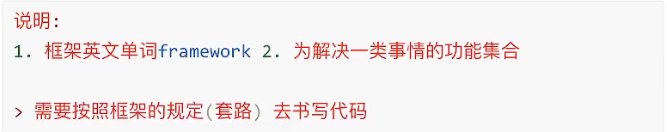
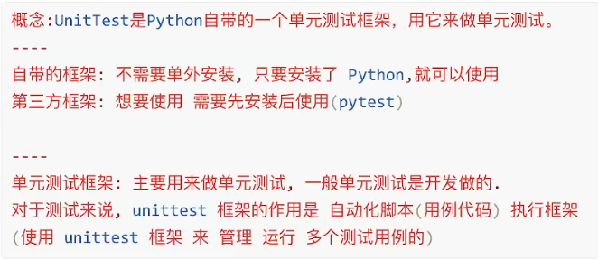
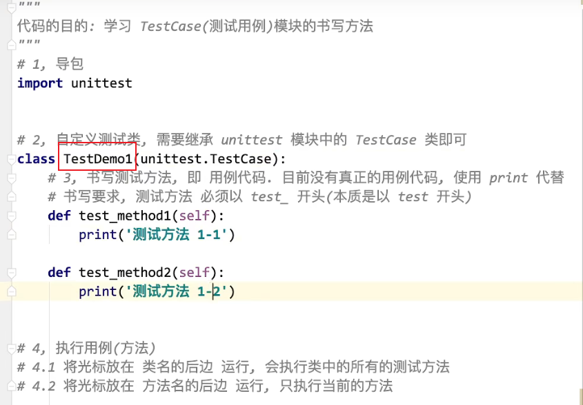
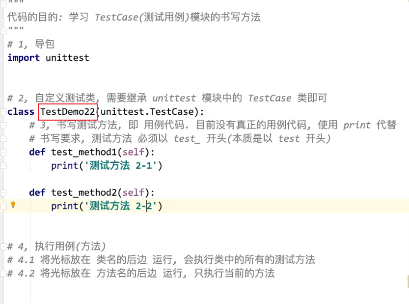
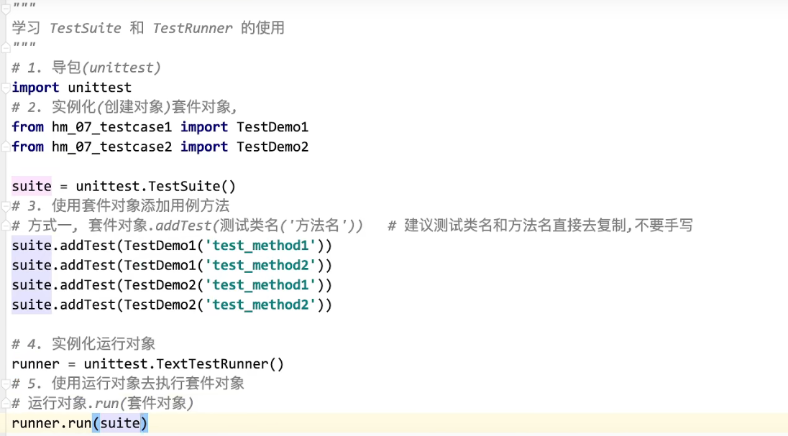
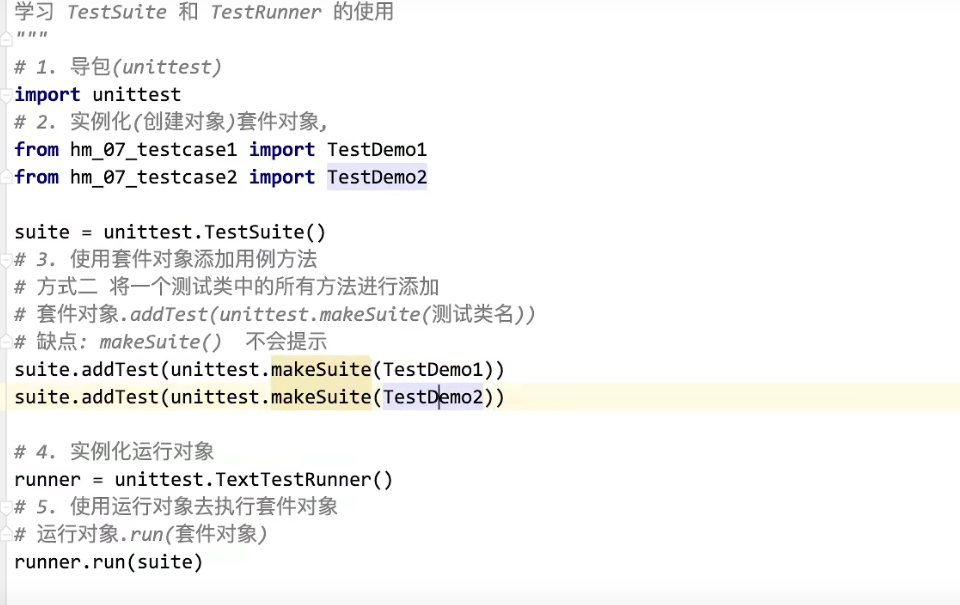
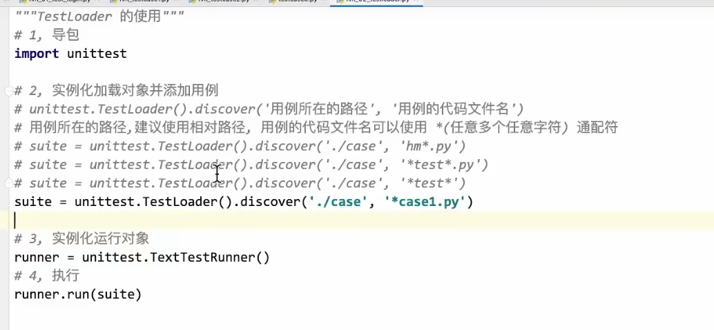
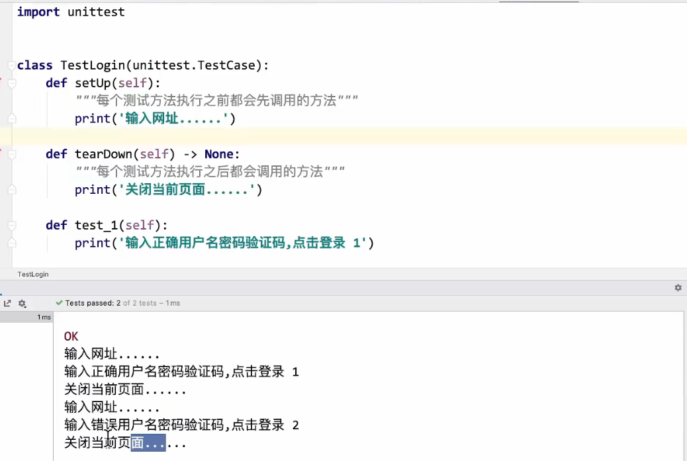
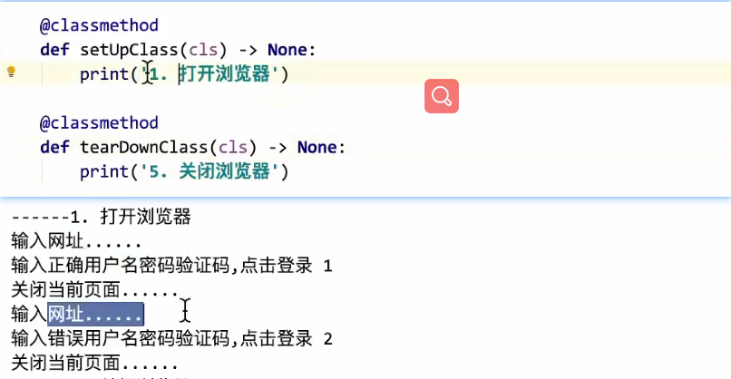

# UnitTest框架

## 介绍

* 框架

  

* 什么是UnitTest框架

  

* 为什么使用UnitTest框架

  

  断言：让程序代码代替人工自动的判断预期结果和实际结果是否相符

  ​

* UnitTest核心要素（unites的组成）

  * TestCase（最核心的模块）

    ```yacas
    TestCase(测试用例)，注意这个测试用例是UninTest框架的组成部分，不是手工和自动化中我们所说的用例（Test Case）

    主要作用：每个TestCase（测试用例都是一个代码文件），在这个代码文件中来书写真正的用例代码
    ```

    ​

  * TestSuite

    ```yacas
    TestSuite（测试套件），用来管理组装（打包）多个TestCase（测试用例的）套件。
    ```

    ​

  * TestRunner

    ```yacas
    TestRunner（测试执行，测试运行），用来执行TestSUITE(测试套件)的。
    ```

    ​

  * TestLoader

    ```yacas
    TestLoader（测试加载），功能是对TestSuite（测试套件）功能的补充，管理 组装（打包）多个TestCase（测试用例）的。如果有大量的TestCase文件，用TestSuite需要一个一个的添加太麻烦，直接使用TestLoader
    ```

    ​

  * Fixture

    ```yacas
    Fixture（测试夹具），书写在TestCase（测试用例）代码中，是一个代码结构，可以在每个方法执行前后都会执行的内容。将每个用例中都会执行的内容写在Fixtrue中。
    举例：
    登录的测试用例
    1、打开网址
    2、输入网址
    因为每个登录都会重复1，2，所以写在Fixture中
    ```


##案例一：

**~使用TestSuite去管理包装Testcase测试类~**

* TestCase代码

​     TestDemo1：

  TestDemo2：



* TestSuite&TestRunner书写

写法一：添加测试类的指定方法



写法二：添加测试类的所有方法




## 案例二：

**~使用TestLoader管理包装测试类~**



`将指定路径下的满足条件的测试类包装起来`


## 案例三：

**~关于使用Fixture~**

```yacas
Fixture是一套代码结构，在某些特定的情况下会自动执行。
在三个级别上使用：
方法级别
类级别
模块级别
```

* 方法级别【掌握】

  ```python
  #方法执行之前
  def setUp(self):
      每个测试方法执行之前都会执行
      pass

  #方法执行之后
  def tearDown(self):
      每个测试方法执行之后都会执行
      pass
  ```

  ​

* 类级别【掌握】

  ```yacas
  在每个测试类中的所有方法执行前后，都会调用的结构（在整个类中，执行之前 执行之后各一次，只执行两次）
  ```

  ```python
  #类级别的Fixture方法，是一个类方法
  #即在类方法上边@classmethod

  @classmethod
  def setUpClass(cls):
      类中所有方法执行之前
      pass

  def tearDownClass(cls):
      类中所有方法执行完之后
      pass


  ```

  ​

* 模块级别【了解】

  ```python
  ##模块级别的需要写在类的外边，直接定义函数即可

  def setUpModule():
      代码文件执行之前
      pass

  def tearDownModule():
      代码文件执行完之后
      pass
  ```


​            **方法级别**




​      **类级别**



