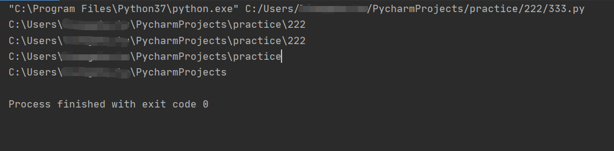
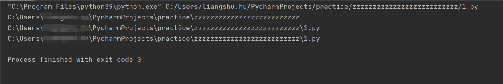
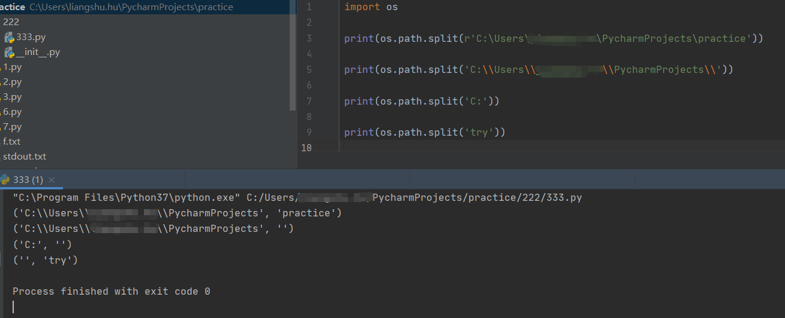
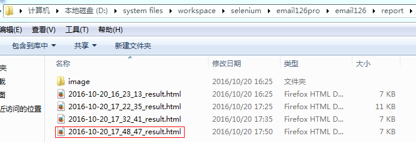
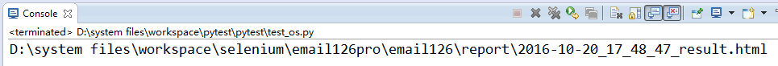

# python中的os模块

## 前言

#### os是operation system（操作系统）的缩写；os就是python对操作系统操作接口的封装。os模块提供了多数操作系统的功能接口函数。

在自动化测试中，经常需要查找操作文件，比如说查找配置文件（从而读取配置文件的信息），查找测试报告（从而发送测试报告邮件），查找测试用例的Excel文件或者Yaml文件等。

## **os函数**

**1、当前路径及路径下的文件**

 os.getcwd() ：查看当前所在路径。【具体到当前脚本的上一级】

 os.listdir(path) ：列举path目录下的所有文件。返回的是列表类型。

```python
import os
os.getcwd() # 'D:\\pythontest\\ostest'
os.listdir(os.getcwd()) #['hello.py', 'test.txt']
```

**2、绝对路径**

 os.path.abspath(path) ：返回当前文件位置的绝对路径。

 os.path.realpath(path) ：返回当前文件位置的绝对路径。

举例1：

[](javascript:void(0);)

```python
import os
print(os.getcwd())
print(os.path.abspath('.'))
print(os.path.abspath('..'))
print(os.path.abspath('../..'))
```

[](javascript:void(0);)

运行结果：



举例2：

[](javascript:void(0);)

```python
import os
print(os.getcwd())
print(os.path.realpath(__file__))
print(os.path.abspath(__file__))
```

[](javascript:void(0);)

运行结果：



**3、查看指定文件路径的文件夹路径部分和文件名部分**

os.path.split(path) ：将指定文件的路径分解为(文件夹路径, 文件名)，返回的数据类型是**元组**类型。

①若文件夹路径字符串最后一个字符是\，则只有文件夹路径部分有值；

②若路径字符串中均无\，则只有文件名部分有值。

③若路径字符串有\，且不在最后，则文件夹和文件名均有值。且返回的文件名的结果不包含\. 



**4、路径拼接**

os.path.join(path1, path2, ...) ：将入参的path进行组合，若其中有绝对路径，则之前的path将被删除。

[](javascript:void(0);)

```python
os.path.split('D:\\pythontest\\ostest\\Hello.py')  #  ('D:\\pythontest\\ostest', 'Hello.py')

os.path.split('.')  #  ('', '.')

os.path.split('D:\\pythontest\\ostest\\') #  ('D:\\pythontest\\ostest', '')

os.path.split('D:\\pythontest\\ostest') #  ('D:\\pythontest', 'ostest')

os.path.join('D:\\pythontest', 'ostest') #  'D:\\pythontest\\ostest'

os.path.join('D:\\pythontest\\ostest', 'hello.py')  #  'D:\\pythontest\\ostest\\hello.py'

os.path.join('D:\\pythontest\\b', 'D:\\pythontest\\a') #  'D:\\pythontest\\a'
```

[](javascript:void(0);)

**5、获取路径的文件夹路径部分 **

 os.path.dirname(path) ：返回path中的文件夹路径部分，且路径结尾不包含'\'。【即返回文件的路径（此路径不包含文件名）】

[](javascript:void(0);)

```python
os.path.dirname('D:\\pythontest\\ostest\\hello.py')  #  'D:\\pythontest\\ostest'

os.path.dirname('.')  #  ''

os.path.dirname('D:\\pythontest\\ostest\\')  #  'D:\\pythontest\\ostest'

os.path.dirname('D:\\pythontest\\ostest')  #  'D:\\pythontest'
```

[](javascript:void(0);)

**6、获取路径的文件名**

 os.path.basename(path) ：返回path中的文件名。

[](javascript:void(0);)

```python
os.path.basename('D:\\pythontest\\ostest\\hello.py')  #  'hello.py'

os.path.basename('.')  #  '.'

os.path.basename('D:\\pythontest\\ostest\\')  #  ''

os.path.basename('D:\\pythontest\\ostest')  #  'ostest'
```

[](javascript:void(0);)

**7、查看文件时间**

 os.path.getmtime(path) ：返回文件或文件夹的最后修改时间，从新纪元到访问时的秒数。

 os.path.getatime(path) ：返回文件或文件夹的最后访问时间，从新纪元到访问时的秒数。

 os.path.getctime(path) ：返回文件或文件夹的创建时间，从新纪元到访问时的秒数。

```python
os.path.getmtime('D:\\pythontest\\ostest\\hello.py')  #  1481695651.857048

os.path.getatime('D:\\pythontest\\ostest\\hello.py')  #  1481687717.8506615

os.path.getctime('D:\\pythontest\\ostest\\hello.py')  #  1481687717.8506615
```

**8、查看文件大小**

 os.path.getsize(path) ：返回文件的大小；若path入参值是一个文件夹路径则返回0。

```python
os.path.getsize('D:\\pythontest\\ostest\\hello.py')  #  58L

os.path.getsize('D:\\pythontest\\ostest')  #  0L
```

**9、查看文件是否存在**

 os.path.exists(path) ：判断文件或者文件夹是否存在，返回True 或 False。【文件或文件夹的名字不区分大小写】

[](javascript:void(0);)

```python
os.listdir(os.getcwd())  #  ['hello.py', 'test.txt']

os.path.exists('D:\\pythontest\\ostest\\hello.py')  #  True

os.path.exists('D:\\pythontest\\ostest\\Hello.py')  #  True

os.path.exists('D:\\pythontest\\ostest\\Hello1.py')  #  False
```

[](javascript:void(0);)

**10、os模块中操作目录以及文件的函数**

 os.mkdir('文件夹名') ：新建文件夹；入参为目录路径，不可为文件路径；（父目录必须存在的情况下创建下一级文件夹）

 os.rmdir('文件夹名') ：删除文件夹；入参为目录路径，不可为文件路径

 os.remove('文件路径') ：删除文件；入参为文件路径，不可谓目录路径

 os.makedirs('路径及文件') ：递归新建文件夹；可以连续创建该文件夹的多级目录

 os.path.isdir('路径') ：判断入参路径是否为文件夹，返回值为布尔值；是文件夹返回True，不是文件夹返回False

 os.path.isfile('路径') ：判断入参路径是否为文件，返回值为布尔值；是文件返回True，不是文件返回False

**10、一些表现形式参数**

os模块中还定义了一组文件、路径在不同操作系统中的表现形式参数。如下：

[](javascript:void(0);)

```python
os.sep  #  '\\'

os.extsep  #  '.'

os.pathsep  #  ';'

os.linesep  #  '\r\n'
```

[](javascript:void(0);)

## 举例

在自动化测试过程中，常常需要发送邮件，将最新的测试报告文档发送给相关人员查看，所以就需要查找最新文件的功能。

举例：查找文件夹下最新的文件。



代码如下：

[](javascript:void(0);)

```python
import os
def new_file(test_dir):
    #列举test_dir目录下的所有文件（名），结果以列表形式返回。
    lists=os.listdir(test_dir)
    #sort按key的关键字进行升序排序，lambda的入参fn为lists列表的元素，获取文件的最后修改时间，所以最终以文件时间从小到大排序
    #最后对lists元素，按文件修改时间大小从小到大排序。
    lists.sort(key=lambda fn:os.path.getmtime(test_dir+'\\'+fn))
    #获取最新文件的绝对路径，列表中最后一个值,文件夹+文件名
    file_path=os.path.join(test_dir,lists[-1])
    return file_path

#返回D:\pythontest\ostest下面最新的文件
print new_file('D:\\system files\\workspace\\selenium\\email126pro\\email126\\report')
```

[](javascript:void(0);)

运行结果：



##  总结

[](javascript:void(0);)

```python
# python--函数 os.sep ：主要用于系统路径中的分隔符
# Windows系统通过是“\\”，Linux类系统如Ubuntu的分隔符是“/”，而苹果Mac OS系统中是“:”

# 常用的os模块命令：
# 1、os.name——name顾名思义就是'名字'，这里的名字是指操作系统的名字，主要作用是判断目前正在使用的平台，并给出操作系统的名字，如Windows 返回 'nt'; Linux 返回'posix'。注意该命令不带括号。
# 2、os.getcwd()——全称应该是'get current work directory'，获取当前工作的目录
# 3、os.listdir(path)——列出path目录下所有的文件和目录名。Path参数可以省略。
# 4、os.remove(path)——删除path指定的文件，该参数不能省略。
# 5、os.rmdir(path)——删除path指定的目录，该参数不能省略。
# 6、os.mkdir(path)——创建path指定的目录，该参数不能省略。
# 7、os.unlink() 方法用于删除文件,如果文件是一个目录则返回一个错误

# os.remove()       #删除文件
# os.rename()       #重命名文件
# os.walk()       #生成目录树下的所有文件名
# os.chdir()       #改变目录
# os.mkdir/makedirs()     #创建目录/多层目录
# os.rmdir/removedirs     #删除目录/多层目录
# os.listdir()       #列出指定目录的文件
# os.getcwd()       #取得当前工作目录
# os.chmod()       #改变目录权限
# os.path.basename()     #去掉目录路径，返回文件名
# os.path.dirname()     #去掉文件名，返回目录路径
# os.path.join()      #将分离的各部分组合成一个路径名
# os.path.split()      #返回(dirname(),basename())元组
# os.path.splitext()     #返回filename,extension)元组
# os.path.getatime\ctime\mtime   #分别返回最近访问、创建、修改时间
# os.path.getsize()     #返回文件大小
# os.path.exists()      #是否存在
# os.path.isabs()      #是否为绝对路径
# os.path.isdir()      #是否为目录
# os.path.isfile()      #是否为文件
# os.system('command') 会执行括号中的命令，如果命令成功执行，这条语句返回0，否则返回1
```