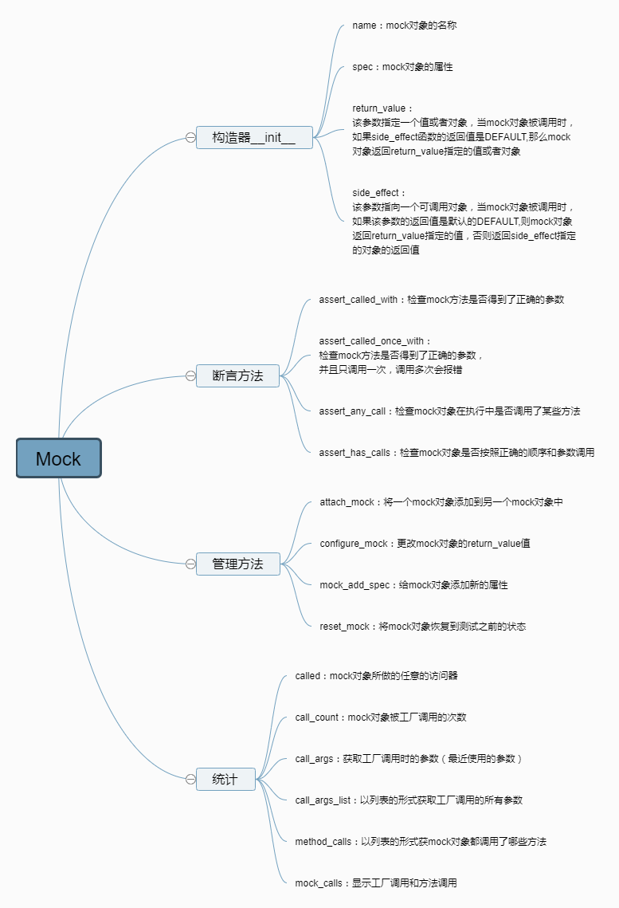

# Untitled单元测试之mock




# 什么是mock

unittest.mock是一个用于在Python中进行单元测试的库，Mock翻译过来就是模拟的意思，顾名思义这个库的主要功能是模拟一些东西。
它的主要功能是使用mock对象替代掉指定的Python对象，以达到模拟对象的行为。

**学过python自动化的对unittest并不陌生，unittest其实是单元测试框架，但对于单元测试，估计很多小伙伴都不懂，单元测试才是自动化测试的至高境界，其中mock是单元测试的脊髓所在**

# mock能做什么：

- 1.前后端联调，如果你是一个前端页面开发，现在需要开发一个功能：
  下一个订单，支付页面的接口，根据支付结果，支付成功，展示支付成功页，支付失败，展示支付失败页。
  要完成此功能，你需要调用后端的接口，根据返回给你的结果，来展示不同的页面。此时后端接口还没开发好，
  作为一个前端开发总不能等别人开发好了，你再开发，那你只有加班的命了。
  为了同步开发完成任务，此时，你可以根据接口文档的规定，把接口的地址和入参传过去，然后自己mock接口的不同返回界面，来完成前端的开发任务
- 2.单元测试，单元测试的目的是测试某个小小单元的功能，但现实中开发的函数或方法都是有依赖关系的，比如b函数的参数，需要调用a函数的返回结果,但是我前面已经测试a函数了
  这种情况下，就不需要再测一次a函数了，此时就可以用mock模块来模拟调用这部分内容，并给出返回结果
- 3.第三方接口依赖，在做接口自动化的时候，有时候需要调用第三方的接口，但是别人公司的接口服务不受你的控制，有可能别人提供的测试环境今天服务给你开着，别人就关掉了，
  给自动化接口测试带来很多的麻烦，此时就可以自己写一个mock-server来模拟接口的返回数据

# 依赖关系

1.如下场景：支付是一个独立的接口，由其它开发提供，根据支付的接口返回状态去显示失败，还是成功，这个是你需要实现的功能

也就是说你写一个b功能，你的同事写一个a功能，你的b功能需要根据a功能的结果去判断，然后实现对应的功能。这就是存在依赖关系，你同事开发的进度你是无法控制的
你要是等他开发完了，你再开发，那你就坐等加班吧.

2.以下是自己写的 zhifu_statues()函数功能，大概设计如下，保存为temple.py文件

```python
# 保存为temple.py

# coding:utf-8
# 作者：上海-悠悠 QQ交流群：588402570

def zhifu():
    '''假设这里是一个支付的功能,未开发完
    支付成功返回：{"result": "success", "reason":"null"}
    支付失败返回：{"result": "fail", "reason":"余额不足"}
    reason返回失败原因
    '''
    pass

def zhifu_statues():
    '''根据支付的结果success or fail，判断跳转到对应页面'''
    result = zhifu()
    print(result)
    try:
        if result["result"] == "success":
            return "支付成功"
        elif result["result"] == "fail":
            print("失败原因：%s" % result["reason"])
            return "支付失败"
        else:
            return "未知错误异常"
    except:
        return "Error, 服务端返回异常!"

```

3.单元测试用例设计

```python
# coding:utf-8
from unittest import mock
import unittest
import temple
# 作者：上海-悠悠 QQ交流群：588402570

class Test_zhifu_statues(unittest.TestCase):
    '''单元测试用例'''
    def test_01(self):
        '''测试支付成功场景'''
        # mock一个支付成功的数据
        temple.zhifu = mock.Mock(return_value={"result": "success", "reason":"null"})
        # 根据支付结果测试页面跳转
        statues = temple.zhifu_statues()
        print(statues)
        self.assertEqual(statues, "支付成功")

    def test_02(self):
        '''测试支付失败场景'''
        # mock一个支付成功的数据
        temple.zhifu = mock.Mock(return_value={"result": "fail", "reason": "余额不足"})
        # 根据支付结果测试页面跳转
        statues = temple.zhifu_statues()
        self.assertEqual(statues, "支付失败")

if __name__ == "__main__":
    unittest.main()

```

### 4.mock中的方法

```
from unittest.mock import Mock
mock_obj = Mock() # 实例化Mock对象
print(dir(mock_obj))
# ['assert_any_call', 'assert_called', 'assert_called_once', 'assert_called_once_with', 'assert_called_with', 'assert_has_calls', 'assert_not_called', 'attach_mock', 'call_args', 'call_args_list', 'call_count', 'called', 'configure_mock', 'method_calls', 'mock_add_spec', 'mock_calls', 'reset_mock', 'return_value', 'side_effect']

```

### 5.Mock中的构造方法

```
from unittest.mock import Mock
print(dir(Mock))
# ['_NonCallableMock__get_return_value', '_NonCallableMock__get_side_effect', '_NonCallableMock__return_value_doc', '_NonCallableMock__set_return_value', '_NonCallableMock__set_side_effect', '__call__', '__class__', '__delattr__', '__dict__', '__dir__', '__doc__', '__eq__', '__format__', '__ge__', '__getattr__', '__getattribute__', '__gt__', '__hash__', '__init__', '__init_subclass__', '__le__', '__lt__', '__module__', '__ne__', '__new__', '__reduce__', '__reduce_ex__', '__repr__', '__setattr__', '__sizeof__', '__str__', '__subclasshook__', '__weakref__', '_call_matcher', '_extract_mock_name', '_format_mock_call_signature', '_format_mock_failure_message', '_get_child_mock', '_mock_add_spec', '_mock_call', '_mock_check_sig', '_mock_return_value', '_mock_side_effect', 'assert_any_call', 'assert_called', 'assert_called_once', 'assert_called_once_with', 'assert_called_with', 'assert_has_calls', 'assert_not_called', 'attach_mock', 'call_args', 'call_args_list', 'call_count', 'called', 'configure_mock', 'mock_add_spec', 'mock_calls', 'reset_mock', 'return_value', 'side_effect']
```

#### 6.name

name:mock对象的标识

```
from unittest import mock
mock_obj = Mock(name = 'xxx')
print(f'name标识{mock_obj}')
# name标识<Mock name='xxx' id='4445533296'>

```

#### 7.return_value(用的最多)

return_value：该参数指定一个值或者对象

```
from unittest import mock
mock_obj1 = mock.Mock(return_value=100)
print(f'return_value 指定值{mock_obj1()}')
# return_value 指定值100

```

#### 8.side_effect

side_effect：该参数指向一个可调用对象（一般是函数）
当mock对象被调用时,如果该参数的返回值是默认的DEFAULT,则mock对象返回return_value指定的值;
否则返回side_effect指定的对象的返回值

```
from unittest import mock
mock_obj2 = mock.Mock(return_value=100, side_effect=None)
print(f'side_effect 默认值为None,输出return_values的值{mock_obj2()}')
# side_effect 默认值为None,输出return_values的值100

mock_obj3 = mock.Mock(return_value=100, side_effect=[200, 300])
print(f'side_effect 指定值{mock_obj3()},return_value的值被覆盖')
# side_effect 指定值200,return_value被覆盖
print(f'side_effect 迭代输出指定值{mock_obj3()}')
# side_effect 迭代输出指定值300

```

#### 9.spec

spec：mock对象的属性值

```
from unittest.mock import Mock
class Foo(object):
    age = 20
    def f1(self):
        return 
    def f2(self, name):
        return name
mock_obj = Mock(spec=Foo)
print(mock_obj.age) 
# <Mock name='mock.age' id='4541307032'>
print(mock_obj.name) 
# AttributeError: Mock object has no attribute 'name' 没有name属性

```

### 10.mock 断言

#### 1.assert_called_with()

assert_called_with(参数arg)：检查函数调用参数是否正确

```python
from unittest.mock import Mock
class Foo(object):
    value = 20
    def f1(self, arg):
        return arg
mock_obj = Mock(spec=Foo)
# f1正确的传参姿势
mock_obj.f1(222)
# mock_obj.f1.assert_called_with()  
# 报错，没有传参
# mock_obj.f1.assert_called_with(11)  
# 报错，应该传222,传了11
# mock_obj.f1.assert_called_with(222)  
# 不报错

```

#### 2.assert_called_once_with()

assert_called_once_with(参数arg)：检查函数调用参数是否正确，但是只调用一次

```
from unittest.mock import Mock
mock = Mock()
mock()
mock.assert_called_once_with()
# 不会报错
mock()
mock.assert_called_once_with() 
# AssertionError: Expected 'mock' to be called once. Called 2 times.
```